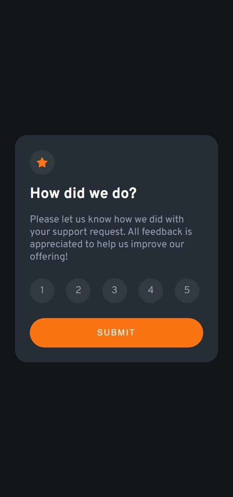
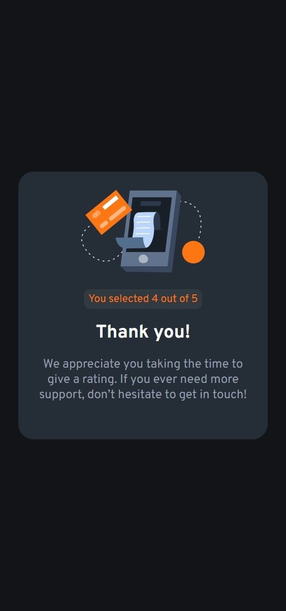
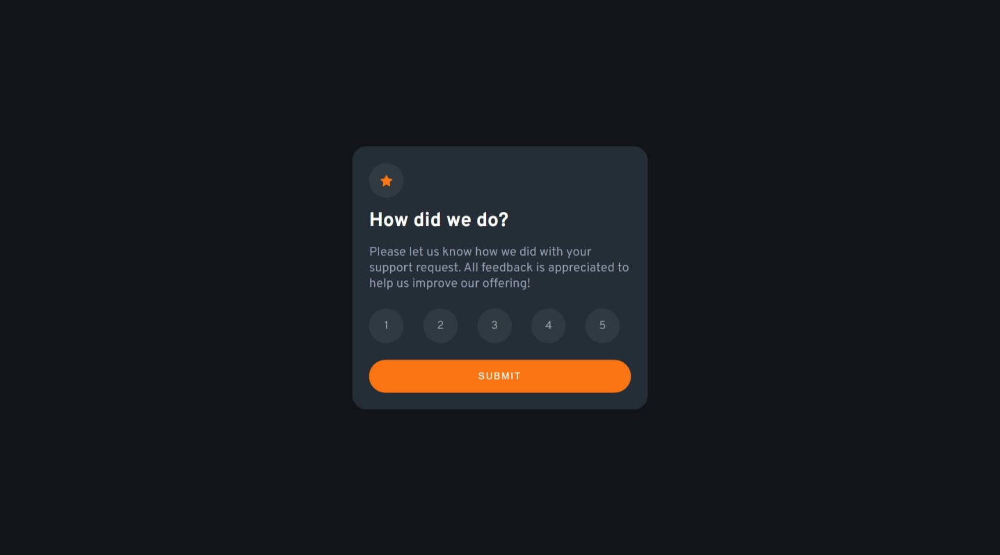
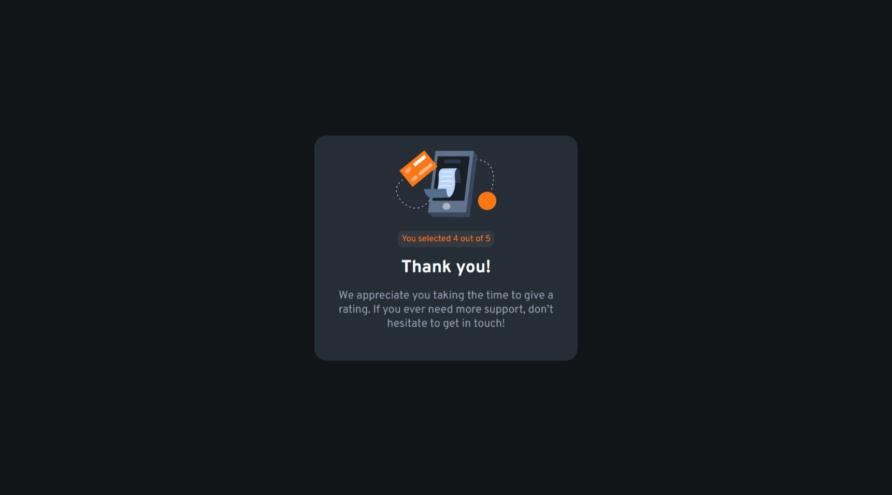

# interactive-rating-component

Small project to practice handling user interactions and updating the DOM.

## Table of contents

- [Overview](#overview)
  - [The challenge](#the-challenge)
  - [Screenshots](#screenshots)
  - [Links](#links)
- [My process](#my-process)
  - [Built with](#built-with)
- [Author](#author)

## Overview

### The challenge

Users should be able to:

- View the optimal layout for the app depending on their device's screen size
- See hover states for all interactive elements on the page
- Select and submit a number rating
- See the "Thank you" card state after submitting a rating

### Screenshots

### Links

- Solution URL: [GitHub](https://github.com/JhonEduard26/interactive-rating-component)
- Live Site URL: [GitHub Pages](https://jhoneduard26.github.io/interactive-rating-component/)

## My process

### Built with

- Semantic HTML5 markup
- CSS custom properties
- Flexbox
- CSS Grid
- Mobile-first workflow

## Author

- Website - [Jhon Eduard Bocanegra](https://github.com/JhonEduard26)
- Frontend Mentor - [@jhoneduard26](https://www.frontendmentor.io/profile/JhonEduard26)
- Twitter - [@JhonBocanegra26](https://twitter.com/JhonBocanegra26)
